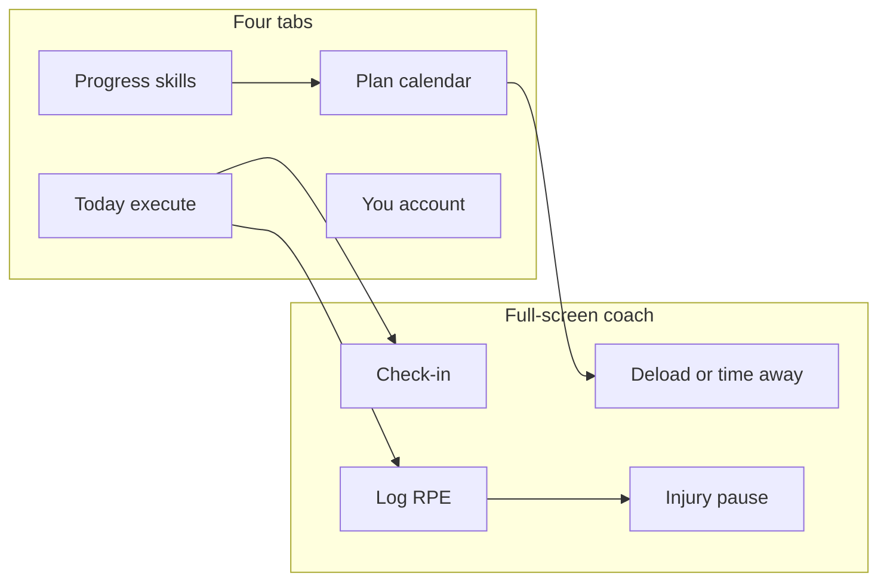

# Ascend full product revamp

Keep **Ascend**. Ship in phases: brand/UI → planning → coach → AI plan creation.

**UX law (locked):** each screen has one job. No dashboards. Prefer empty space over secondary widgets. Coach actions open dedicated full screens, not stacked sheets on Today.

---

## Product north stars

| Inspiration | What we take |
| ----------- | ------------ |
| **Wealthsimple** | Quiet chrome, one accent, typography-led, almost no cards |
| **TrainingPeaks** | Month planning + clear week load (inside Plan, not a fifth tab) |
| **Runna** | Stepped plan build → AI generate; adaptations with plain-language why |



---

## Navigation (locked) — 4 tabs

| Tab | One job |
| --- | ------- |
| **Today** | Do / log today’s work + see coach banners |
| **Plan** | See and edit the calendar (month default, week list toggle) |
| **Progress** | Browse skills + strength paths (segmented); drill into details |
| **You** | Account, appearance, Pro, check-in cadence, resume injury |

Week view lives as a toggle **inside Plan** — not its own tab.

### Maps from current app

| New | Current |
| --- | ------- |
| Today | [app/(tabs)/(home)/index.tsx](../app/(tabs)/(home)/index.tsx) |
| Plan | New calendar surface; absorb create/edit plan chrome from Home |
| Progress | Fold [skills](../app/(tabs)/(skills)/index.tsx) + [strength](../app/(tabs)/(strength)/index.tsx) |
| You | Rename [profile](../app/(tabs)/(profile)/index.tsx) |
| Log | Evolve [app/(tabs)/(home)/workout.tsx](../app/(tabs)/(home)/workout.tsx) → dedicated log completion |
| Paywall | [app/(onboarding)/paywall.tsx](../app/(onboarding)/paywall.tsx) |

---

## Screen-by-screen (locked)

### 1. Sign-in — [app/(onboarding)/signin.tsx](../app/(onboarding)/signin.tsx)

**Job:** get in

- Large Ascend mark, one line of copy
- Sign in with Apple primary (when available); email/password secondary; guest continue allowed if already supported
- No feature grid, no testimonials

### 2. Onboarding — [app/(onboarding)/](../app/(onboarding)/)

**Job:** collect training inputs → generate plan

Stepped wizard (keep current core inputs, restyle):

1. Level (beginner / intermediate / advanced)
2. Training days per week
3. Goal type (skill / strength)
4. Primary goal id
5. Final step: **“Building your plan…”** → AI structured generate; catalog fallback on failure ([backend/planGeneration.ts](../backend/planGeneration.ts))

- No chat UI in v1 (simpler than Runna chat)
- No extra question sprawl unless later needed
- Sample / free preview funnel can still gate Pro after first value (see monetization); do not clutter onboarding with paywall mid-wizard

### 3. Today — Home → Today

**Job:** today’s sessions only

- Full list of sessions scheduled today (not hero-only)
- Rest day: one calm line (“Rest — recover”) + optional single coach banner max
- Adaptation: engine auto-applies → banner “We adapted X — Review / Undo” (not silent toast-only, not blocking sheet)
- At most **one** primary banner (adapt **or** check-in due **or** injury active) — never a stack of cards
- Tap session → Log

### 4. Week (folded into Plan)

**Job:** scan one week’s load

- Inside Plan: **Month | Week** segment control
- Week = dense vertical list with per-day load headers (minutes or volume proxy), not a 7-column grid
- No drag on week list if it adds clutter — drag stays on month (or long-press reschedule only where already clear)

### 5. Plan — new Plan tab + calendar

**Job:** own the training calendar

- Month grid is default (discipline/session dots; tap day → session list for that day)
- Secondary: Week list toggle
- Compact header: primary goal + training days (not a settings form dump)
- Actions as single links, not a control panel: **Time away**, **Rebuild plan** (Pro), **Edit goal** → push to focused sub-screens
- Drag-reschedule on month (new behavior once plans have calendar dates)
- Absorb / demote current Home clutter: create-plan, presets entry points become focused pushes from Plan or Progress — not widgets on Today

### 6. Progress — Skills + Strength

**Job:** explore progressions (not coaching, not a dashboard)

- Segment control: **Skills | Strength**
- Lists and detail routes stay (restyle [skill-details](../app/(tabs)/(skills)/skill-details.tsx), [path-details](../app/(tabs)/(strength)/path-details.tsx), exercise details)
- “Add to plan” / assign day = focused push, not inline multi-step on Progress
- No streak grids, weekly charts, or stats strips on this tab

### 7. Log — session complete / RPE

**Job:** record how the session went

- Completed vs missed + **RPE 1–10** (primary signal; replaces easy / on_target / hard if those exist)
- Optional pain / niggle toggle → if on, continue to Injury full screen
- Notes optional (prompted if RPE high or niggle)
- Map legacy `Plan.completed` / history shapes during migration if needed

### 8. You — rename Profile

**Job:** account & preferences (not coaching)

Sections:

- Profile
- Appearance
- Check-in cadence (weekly | monthly)
- Pro
- Sign out
- Delete

Active injury: **Resume training** (clears pause) — only control, not a history feed.

Vacation / check-in history: omit from v1 (keep You short).

Wearables: defer unless already wired; do not invent a fake integrations panel.

### 9. Paywall — [app/(onboarding)/paywall.tsx](../app/(onboarding)/paywall.tsx)

**Job:** convert to Pro

- Narrative headline (“Your coach that adapts”) + 3 bullets + packages + restore + legal
- No feature comparison matrix

### 9a. Check-in (new full screen)

**Job:** set availability for the next period

- Full screen (not sheet)
- Cadence: weekly or monthly (preference in You; prompt when due)
- Inputs: available days (+ optional hours / note) — keep form short
- On save: reshuffle / trim sessions for that window; return to Today with one-line confirmation

### 9b. Deload / time away (new full screen, from Plan)

**Job:** mark a date range and how to treat it

- Pick start / end
- Mode (pick one): Rest days | Easy / deload | Skip sessions (remove or leave unscheduled)
- Apply → rewrite range; simple confirmation
- No post-deload “compress” UI in v1 unless automatic and invisible

### 9c. Injury pause (new full screen, from Log niggle or You)

**Job:** pause training until cleared

- Pause until further notice (open-ended `PlanBlock`, no end date required)
- Copy must include: please see a doctor / physio — Ascend is not medical care
- While active: calendar shows pause; Today shows single injury banner with link to You → Resume
- Scope default: whole plan pause (simplest). Skill/path-only pause deferred

---

## Tab bar

**Today · Plan · Progress · You** only.

---

## Phase 0 — Brand + UI

Name stays **Ascend**. Change logo + color system (leave dark-lime / violet signature behind).

### Visual (locked)

| Token | Hex | Use |
| ----- | --- | --- |
| Canvas | `#FAFAF8` | App background |
| Text | `#111111` | Primary type |
| Muted | `#6B6B6B` | Secondary type |
| Accent | `#0F766E` | Single CTA / active tab |
| Dark | `#0C0C0C` | Inverse surfaces / optional splash |

- Geometric sans: **DM Sans** (or similar)
- No cream-as-brand, no purple, no Bebas, no neon lime as the signature accent
- Quiet chrome, typography-led, almost no cards (Wealthsimple restraint)

### Tokens & primitives

- Tokens: [global.css](../global.css), [utils/theme.ts](../utils/theme.ts) (and retire multi-theme noise over time; Appearance can stay light/dark later if needed — default is light canvas)
- Primitives: Screen / Button / Text — fewer borders/shadows
- Restyle all screens; collapse tab shell to 4 tabs above
- Update [ascend.md](../ascend.md) when Wave A lands so design system matches this doc
- New icon / splash from logo prompts below

### Logo prompts

**Primary mark**

Minimal modern app icon for “Ascend”, a calisthenics skill & strength coach. Abstract mark: upward stepped peak / chevron formed by three ascending bars (beginner → intermediate → skill), converging into one clean rise. Flat vector, single accent color `#0F766E` on `#FAFAF8`, no gradients, no photorealism, no text in icon, generous padding, SF Symbols–adjacent simplicity, Wealthsimple-level restraint. Square, centered, works at 16px and 1024px.

**Wordmark**

Clean sans-serif wordmark “Ascend”, geometric, slightly condensed, medium weight, letterspacing tight. Color `#111111` on white. Optional small three-step peak mark to the left of the word. No tagline. Fintech-calm, athletic-precise. Vector style.

**Splash**

Full-bleed soft abstract background of faint ascending step lines / motion arcs on `#FAFAF8` (teal hint / charcoal), large centered Ascend wordmark + small peak icon above. No screenshots, no people, no clutter.

---

## Phase 1 — Planning UX

- Month grid default on Plan; Week = dense list + daily load headers
- Drag on month; Today stays a pure day list
- Goal / time away / rebuild as focused pushes, not inline forms on the calendar
- Plans need **calendar dates** (or a scheduled-date field). Current [types/Plan.ts](../types/Plan.ts) `dayIndex` 1–7 alone is not enough for month/week views — migrate or dual-write in this phase

**Ship:** see goal block by month, switch to week list, move a workout, Today stays uncluttered.

---

## Phase 2 — Coach intelligence

### Data model ([types/](../types/) — extend; implement in Wave C)

```ts
type AvailabilityCheckIn = {
  period: 'week' | 'month';
  periodKey: string;       // Monday date or YYYY-MM
  availableDays: number[]; // 0-6
  hoursAvailable?: number;
  notes?: string;
  createdAt: string;
};

type PlanBlock = {
  id: string;
  type: 'deload' | 'injury'; // deload covers vacation / time away
  startDate: string;
  endDate?: string | null; // null = until further notice (injury)
  deloadMode?: 'rest' | 'easy' | 'skip';
  note?: string;
};

type AdaptationEvent = {
  id: string;
  reason: 'missed_workouts' | 'check_in' | 'deload' | 'injury' | 'manual';
  createdAt: string;
  summary: string; // plain-language why
  sessionPatches: {
    sessionId: string;
    before: Partial<AthleteSession>;
    after: Partial<AthleteSession>;
  }[];
};

// Logging (on session / workout history)
type SessionLog = {
  status: 'completed' | 'missed';
  rpe?: number; // 1-10
  niggle?: boolean;
  notes?: string;
};
```

Map legacy completion flags into `SessionLog` during migration. `AthleteSession` is the calendar-aware session record introduced with Plan dates (name can match existing Plan + history shapes).

### Auto-adapt

- On missed (and high RPE patterns later): apply patches → Today banner Review / Undo
- Free: teaser banner → paywall

### Check-in / deload / injury

- As locked in screens 9a–9c
- Injury prevention soft copy only when logging high RPE streaks — never diagnose

Existing auto-progression ([backend/autoProgression.ts](../backend/autoProgression.ts)) stays a progression concern; coach adaptations are calendar/load reshuffles with explainable summaries.

---

## Phase 3 — AI plan creation

- Stepped onboarding → **Gemini** structured `TrainingPlan` JSON → validate → materialize sessions
- Catalog / rule-based fallback via existing [backend/planGeneration.ts](../backend/planGeneration.ts)
- LLM writes adaptation **summary** text; **rules** own the patches
- Pro-gate generative rebuild from Plan
- No coach chat streaming in v1

---

## Monetization (locked — A)

Pro subscription only for this revamp. No coach marketplace, no à-la-carte coach plan SKUs.

| Tier | Gets |
| ---- | ---- |
| **Free** | Preview / sample experience, Today list, basic Plan view, Progress browse (limited) |
| **Pro** | AI plan generation, auto-adapt + Review/Undo, check-ins, deload modes, injury pause, calendar drag depth, full Progress actions |

Paywall copy = **“your coach that adapts”** (narrative + 3 bullets). Existing RevenueCat weekly / yearly products and entitlement `"Ascend Pro"` ([constants/revenuecat.ts](../constants/revenuecat.ts)) stay the spine.

Explicitly deferred (v2+): curated coach-authored plan packs or an open marketplace. Do not design Plan / You UI for a store in v1.

Sample-before-paywall and conversion funnel details remain in [retention-conversion-spec.md](./retention-conversion-spec.md); this revamp must not regress Week 2 conversion work.

---

## Build waves

| Wave | Ship |
| ---- | ---- |
| **A** | Tokens, fonts, logo, 4-tab shell, restyle Sign-in / Today / Plan / Progress / You / Paywall |
| **B** | Month calendar + week list toggle; simplify Plan chrome; calendar dates on plans |
| **C** | Adapt banner, check-in screen, deload modes, injury pause + Resume |
| **D** | AI onboarding generate; Log RPE + niggle path; adaptation copy |

Docs: this file (`docs/REVAMP.md`) is the source of truth when Wave A starts.

---

## Out of scope (v1)

- Android / web
- CTL / ATL / TSS
- Coach chat streaming
- Skill/path-only injury pause
- Post-deload manual compress UI
- Check-in / deload history feeds on You
- 7-column week grid
- Medical diagnosis language (disclaimer only)
- Coach plan marketplace / selling third-party coach plans (deferred v2+)
- Renaming the app
- Restoring neon lime / violet as brand signature
