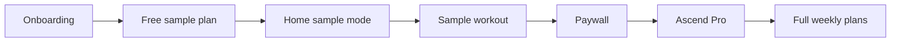

# Ascend Retention & Conversion Specification

**Version:** 1.1  
**Date:** July 18, 2026  
**Status:** Week 2 conversion — **active focus**

---

## 1. Executive summary

Week 1 production data (RevenueCat, Jul 11–18 2026) shows **healthy acquisition** (~76 new customers, ~9.5/day, DACH-heavy organic iOS) but **broken monetization** (~1.5% initial conversion, 2 trials, 0% trial→paid, $0 revenue).

**Diagnosis:** Paywall conversion problem, not retention. Users open the app but almost never start a trial.

**Active strategy:** Value before paywall — one free sample workout from onboarding answers, then personalized paywall. Defer push/retention work until trial volume is meaningful (≥10 trials/week).

### North-star metrics

| Metric | Definition | Target (90 days) | Week 1 actual |
|--------|------------|------------------|---------------|
| **Trial → Paid** | Users who convert after 3-day trial | > 40% | 0% (n=2) |
| **D1 activation** | Subscribers who complete Workout 1 within 24h | > 60% | N/A (almost no trials) |
| **W1 retention** | Subscribers with ≥1 workout in week 1 | > 50% | N/A |
| **Paywall → Trial / Initial conversion** | New customers who start trial/purchase in 7d | > 15% | **~1.5%** |

---

## 2. Week 1 RevenueCat findings (Jul 11–18 2026)

**Project:** Ascend (`proja743f987`)

| Metric | Result | Verdict |
|--------|--------|---------|
| New customers | **76** (~9.5/day) | Acquisition OK |
| Active customers trend | Rising (weekly 18 → 119 → 151) | Reopens happening |
| Initial conversion (7d) | **~1.5%** (2 conversions / 137 over ~2 weeks) | Broken |
| New trials | **2** (Jul 11, Jul 13) | Too few |
| Trial → paid | **0%** (2 expired, 0 converted) | Fix trial starts first |
| Revenue | **$0** | No monetization |
| Active paid subs | **3** (flat) | Stale / pre-release |
| Platform | **100% iOS** | Android unused |
| Top countries | DE 52, AT 12, CH 5, US 2 | DACH organic |
| Attribution | No ASA / all unattributed | Organic / ASO |
| Webhooks | **None** | No server events |

**Charts:** [New customers](https://app.revenuecat.com/projects/a743f987/charts/customers_new) · [New trials](https://app.revenuecat.com/projects/a743f987/charts/trials_new) · [Initial conversion](https://app.revenuecat.com/projects/a743f987/charts/initial_conversion)

### Firebase / Apple limitations

- Firebase MCP has no GA4 event charts. Client events require `MEASUREMENT_API_SECRET` — see [`docs/ga4-measurement-protocol.md`](ga4-measurement-protocol.md).
- Apple App Store Connect is not wired to Cursor; check Product Page Views → Downloads manually.

### Product setup

| Item | App value | Status |
|------|-----------|--------|
| Entitlement ID | `Ascend Pro` | ✅ `constants/revenuecat.ts` |
| Weekly / annual | `$rc_weekly` / `$rc_annual` | ✅ |
| iOS API key | `REVENUECAT_API_KEY` | ✅ |
| Android API key | Placeholder | ❌ Deferred (0 Android users) |
| RC customer attributes | Set on purchase | ✅ Week 2 |
| Webhooks | None | Deferred until trials exist |

---

## 3. Funnel (Week 2)

```
Sign in / Guest
  → Steps 1–4 (level, days, goal)
  → Initialize user + generateSamplePlan (1 day)
  → Home (sample mode — Home only)
  → Sample workout
  → Paywall (source=sample_workout)
  → Purchase → expand to full weekly plans
  → Full app
```



Non-Pro users can access **Home + sample workout only**. Skills, Strength, AI Coach, and Profile tabs route to the paywall.

---

## 4. Implementation roadmap

### Week 1 — Activation ✅ Done

Auto-plans after purchase, Home hero/streak/checklist, entitlement fix, paywall personalization, funnel events.

### Week 2 — Conversion ✅ Active (shipped in code)

| Task | Status | Notes |
|------|--------|-------|
| 1 free sample workout before paywall | ✅ Done | `generateSamplePlan`, step4 → Home |
| Gate Skills/Strength/AI/Profile without Pro | ✅ Done | `app/(tabs)/_layout.tsx` |
| Paywall after sample with `source=sample_workout` | ✅ Done | workout finish + access routing |
| Sample analytics events | ✅ Done | `sample_workout_started/completed` |
| RevenueCat customer attributes on purchase | ✅ Done | `Purchases.setAttributes` |
| Wire `MEASUREMENT_API_SECRET` for EAS | ✅ Done | `eas.json` + setup doc — **set secret value in EAS/GA4** |
| Subscription status in Profile | 🔲 Deferred | |
| Android RevenueCat key | 🔲 Deferred | 0 Android users week 1 |

### Week 3 — Retention (deferred until trials ≥10/week)

Push reminders, trial countdown, daily streak — do **not** prioritize while conversion is ~1.5%.

### Week 4 — Optimize

Webhooks, win-back offering, GA4 funnel review after secret is live.

---

## 5. Sample + full plan generation

### 5.1 Sample plan (pre-paywall)

`generateSamplePlan(userId)` in [`backend/planGeneration.ts`](../backend/planGeneration.ts):

- Trigger: end of onboarding step 4
- Creates **one** plan for today's day index (Mon=1 … Sun=7)
- Sets `user.samplePlanId`
- Idempotent if sample already exists

### 5.2 Full plans (post-purchase)

`generateInitialPlans(userId)`:

- Trigger: successful purchase / restore
- Creates remaining training-day plans (skips days that already exist from sample)
- Sets `user.initialPlansGenerated = true`

### 5.3 User fields

| Field | Meaning |
|-------|---------|
| `samplePlanId` | Free Day-1 plan id |
| `sampleWorkoutCompleted` | Sample finished → paywall on next launch |
| `initialPlansGenerated` | Full week expanded after purchase |

---

## 6. Analytics event spec

| Event | Trigger | Params |
|-------|---------|--------|
| `onboarding_step_completed` | Steps 1–4 | `step`, … |
| `sample_workout_started` | Start tap in sample mode | `plan_id` |
| `sample_workout_completed` | Sample finish | `plan_id` |
| `paywall_viewed` | Offerings loaded | `source`: `sample_workout` \| `home_unlock` \| `tab_gate` \| `returning` \| … |
| `paywall_purchase_tapped` | CTA | `package_id` |
| `trial_started` | Purchase success | `package_id` |
| `plans_generated` | Full plan expand | `plan_count`, `goal_type` |
| `workout_completed` | History saved | `exercise_count` |

Setup: [`docs/ga4-measurement-protocol.md`](ga4-measurement-protocol.md)

---

## 7. Success criteria (re-check RC in 7 days)

- [ ] Initial conversion moves from **~1.5% toward ≥8–15%**
- [ ] New trials **≥10/week**
- [ ] GA4 Realtime shows `sample_workout_*` and `paywall_viewed` (after secret set + rebuild)
- [ ] Sample users land on Home with one workout without paying
- [ ] Completing sample routes to paywall with personalized copy

---

## Appendix: Key files

| Concern | Path |
|---------|------|
| Access routing | `utils/access.ts` |
| Sample / full plans | `backend/planGeneration.ts` |
| Entry | `app/index.tsx` |
| Onboarding finish | `app/(onboarding)/step4.tsx` |
| Paywall | `app/(onboarding)/paywall.tsx` |
| Tab gate | `app/(tabs)/_layout.tsx` |
| Home sample UX | `app/(tabs)/(home)/index.tsx` |
| Workout → paywall | `app/(tabs)/(home)/workout.tsx` |
| Analytics | `utils/analytics.ts` |
| GA4 setup | `docs/ga4-measurement-protocol.md` |
| Design system | `ascend.md` |
